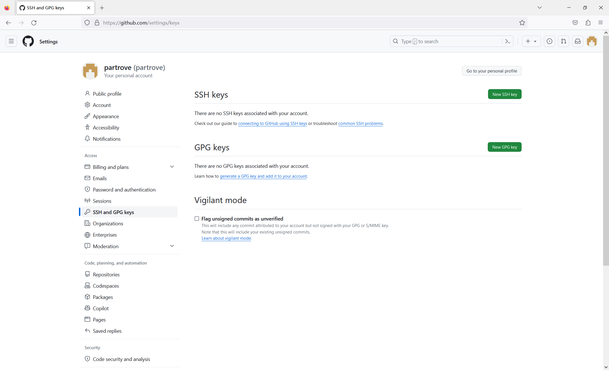
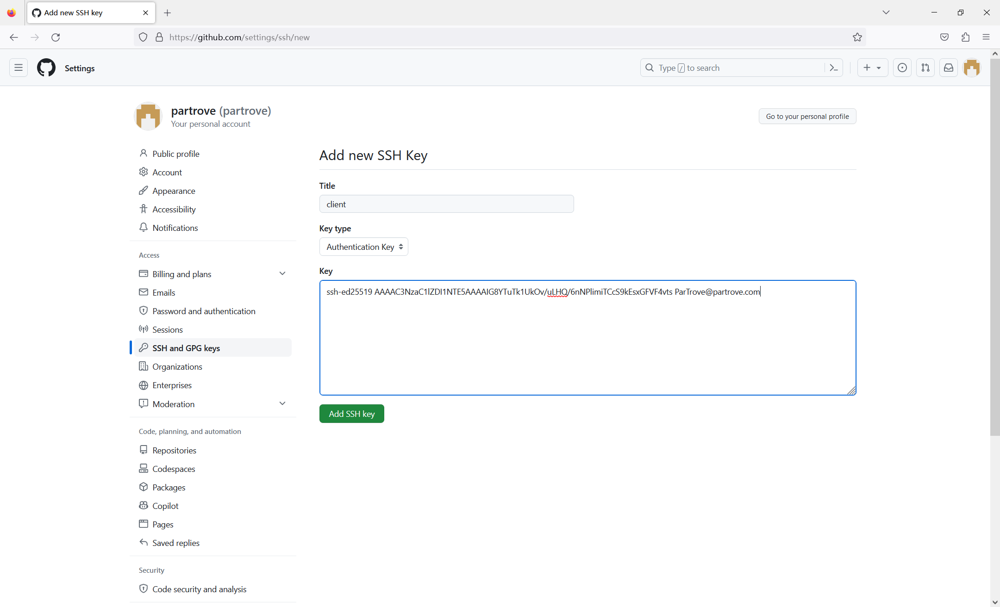

+++
date = 2024-03-02T15:45:54+08:00
draft = false
title = "使用SSH连接Github仓库"
isCJKLanguage = true
+++

一般情况下，我们都是通过 HTTPS 的方式来推拉 Github 仓库，但如果 HTTPS 方式不能用的时候，还有没有其他方法可以使用呢？这里就介绍另一种使用 SSH Key 的来访问 Github 仓库的配置方法。  

使用 SSH Key 的前提是 SSH 工具，Linux/MacOS 一般自带，Windows 平台下推荐 Git Bash。  

# 客户端创建 SSH Key  

在要连接 Github 的主机上，使用 `ssh-keygen` 命令创建一个密钥对，`-t` 指定密钥文件的加密算法为 **ed25519**，`-C` 为生成的密钥添加备注，这里一般用邮箱地址。  

```shell
$ ssh-keygen -t ed25519 -C "ParTrove@partrove.com"  # 执行命令进入交互操作
Generating public/private ed25519 key pair.
Enter file in which to save the key (/home/feolee/.ssh/id_ed25519): ./github_ed25519  # 指定密钥文件存放路径
Enter passphrase (empty for no passphrase):  # 给密钥设置密码，按回车直接跳过
Enter same passphrase again:
Your identification has been saved in ./github_ed25519
Your public key has been saved in ./github_ed25519.pub
The key fingerprint is:
SHA256:k8byZzJPekd4iuB9oMxP5XSniOWY8UaUXwBMULBz2nY ParTrove@partrove.com
The key's randomart image is:
+--[ED25519 256]--+
|        o*+..    |
|         ... .   |
|        o +   .  |
|       . B . .   |
|      . S B.E .  |
|      .+./.+oo   |
|     + +OoX+.    |
|      =.oX+ .    |
|       .oo..     |
+----[SHA256]-----+
```  

创建好密钥对之后，先把公钥内容打印出来  

```shell
$ cat github_ed25519.pub
ssh-ed25519 AAAAC3NzaC1lZDI1NTE5AAAAIG8YTuTk1UkOv/uLHQ/6nNPlimiTCcS9kEsxGFVF4vts ParTrove@partrove.com
```  

# 设置 Github 密钥  

登录到 Github，依次点击右上角头像——Settings——SSH and GPG keys——New SSH key，进入新建SSH Key页面



然后填写密钥信息



- Title：配置项的名称，随便起  
- Key type：密钥类型，选 Authentication Key
- Key：将前面打印出来的公钥内容粘贴进去

然后点击 **Add SSH key** 保存。  

# 配置本地 git  

要让本地客户端的 git 可以通过 SSH 推拉 Github 仓库，首先需要对本地 ssh 进行配置。  

编辑 *$HOME/.ssh/config* 文件，添加以下配置：  

```plaintext
Host github.com
  User git
  Hostname github.com
  PreferredAuthentications publickey
  IdentityFile /d/Development/Projects/Secrets/key/feolee_ed25519
  IdentitiesOnly yes
```  

- Host：远端主机名称，也可以理解成就是一个别名；  
- Host.User：因为是给本地 git 客户端使用的，这里设置成 git ；  
- Host.Hostname：远端主机的主机名，可以是域名，其他的场景也可以是主机 IP ；  
- Host.PreferredAuthentications：优先使用的认证方式，设置成公钥认证；  
- Host.IdentityFile：私钥文件路径；  
- Host.IdentitiesOnly：只使用这里指定的密钥来认证  

保存后，就可以用 SSH 方式来推拉仓库了。  

```shell
$ git clone git@github.com:partrove/partrove.com.git
Cloning into 'partrove.com'...
The authenticity of host 'github.com (20.205.243.166)' can't be established.
ED25519 key fingerprint is SHA256:+DiY3wvvV6TuJJhbpZisF/zLDA0zPMSvHdkr4UvCOqU.
This key is not known by any other names.
Are you sure you want to continue connecting (yes/no/[fingerprint])? yes
Warning: Permanently added 'github.com' (ED25519) to the list of known hosts.
remote: Enumerating objects: 113, done.
remote: Counting objects: 100% (113/113), done.
remote: Compressing objects: 100% (44/44), done.
remote: Total 113 (delta 49), reused 113 (delta 49), pack-reused 0
Receiving objects: 100% (113/113), 76.25 KiB | 441.00 KiB/s, done.
Resolving deltas: 100% (49/49), done.
```  

# HTTPS 拉取的仓库切换成 SSH

进入已经拉下来的仓库路径，执行命令查看远端仓库信息  

```shell
$ git remote -v
origin  https://github.com/partrove/partrove.com.git (fetch)
origin  https://github.com/partrove/partrove.com.git (push)
```  

可以发现目前是 HTTPS 链接，执行下面的命令进行切换  

```shell
$ git remote set-url origin git@github.com:partrove/partrove.com.git
```  

再次查看，已经切换到 SSH  

```shell
$ git remote -v
origin  git@github.com:partrove/partrove.com.git (fetch)
origin  git@github.com:partrove/partrove.com.git (push)
```